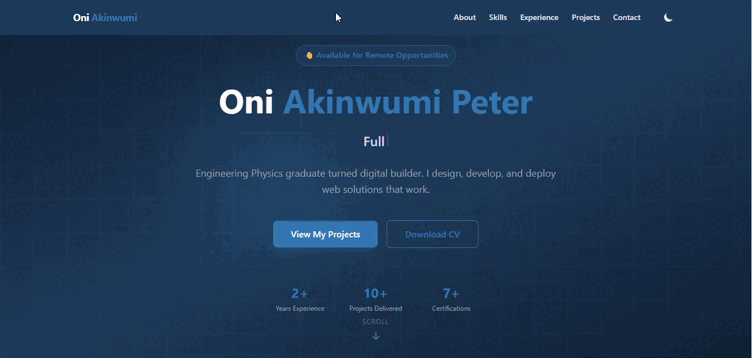

<div align="center">

# ⚡ Oni Akinwumi Peter — Developer Portfolio

### A fast, responsive, and accessible personal portfolio built with React, Tailwind CSS, and Framer Motion.

[](https://portfolio-akinwumi-oni.vercel.app/)
[](LICENSE)
[](https://react.dev)
[](https://tailwindcss.com)
[](https://vitejs.dev)
[](https://vercel.com)

<br />



_Replace the image above with an actual screenshot once deployed_

</div>

---

## 📌 Overview

This is my personal developer portfolio — a single-page application that serves as my public professional identity online. It showcases my skills, experience, projects, and certifications, and gives recruiters and clients a single place to learn about me and get in touch.

Built to be **fast**, **accessible**, and **easy to maintain** — with a Lighthouse score of 90+ across all metrics.

---

## ✨ Features

- **9 fully responsive sections** — Navbar, Hero, About, Skills, Experience, Projects, Certifications, Contact, Footer
- **Dark / Light mode** — Class-based toggle, persists across sections
- **Typewriter animation** — Cycles through professional roles in the Hero section
- **Scroll-triggered animations** — Framer Motion entrance animations on every section
- **Smooth scroll navigation** — react-scroll with active link highlighting
- **CV download** — One-click PDF download from the Hero section
- **Mobile-first** — Hamburger menu, responsive grids, tested across breakpoints
- **Performance optimised** — Vite build, compressed assets, lazy loading ready

---

## 🗂️ Sections

| Section            | Description                                                 |
| ------------------ | ----------------------------------------------------------- |
| **Navbar**         | Sticky, scroll-aware, dark mode toggle, mobile hamburger    |
| **Hero**           | Name, typewriter role animation, CTA buttons, stats row     |
| **About**          | Bio, profile photo, tech stack icon grid                    |
| **Skills**         | 8 categorised skill cards with colour-coded headers         |
| **Experience**     | Vertical timeline — Freelance, NYSC, Undergraduate Research |
| **Projects**       | 6-card responsive grid with live/coming-soon status badges  |
| **Certifications** | 7 credential cards with IDs for verification                |
| **Contact**        | 5 clickable contact method cards                            |
| **Footer**         | Social links, tagline, copyright                            |

---

## 🛠️ Tech Stack

| Layer                | Technology        |
| -------------------- | ----------------- |
| **Framework**        | React 18 via Vite |
| **Styling**          | Tailwind CSS v4   |
| **Animations**       | Framer Motion     |
| **Icons**            | React Icons       |
| **Routing / Scroll** | react-scroll      |
| **Deployment**       | Vercel            |
| **Version Control**  | Git + GitHub      |

---

## 🚀 Getting Started

### Prerequisites

Ensure you have the following installed:

```bash
node -v   # v18 or higher
npm -v    # v9 or higher
git --version
```

### Installation

```bash
# Clone the repository
git clone https://github.com/vividwebdev/portfolio.git

# Navigate into the project
cd portfolio

# Install dependencies
npm install

# Start the development server
npm run dev
```

The app will be running at **http://localhost:5173**

### Build for Production

```bash
npm run build
```

Output is generated in the `/dist` folder — ready for deployment.

### Preview Production Build Locally

```bash
npm run preview
```

---

## 📁 Project Structure

```
portfolio/
├── public/
├── src/
│   ├── assets/
│   │   ├── profile.jpg               ← Profile photo
│   │   └── Oni_Akinwumi_Peter_CV.pdf ← Downloadable CV
│   ├── components/
│   │   ├── Navbar.jsx
│   │   ├── Hero.jsx
│   │   ├── About.jsx
│   │   ├── Skills.jsx
│   │   ├── Experience.jsx
│   │   ├── Projects.jsx
│   │   ├── Certifications.jsx
│   │   ├── Contact.jsx
│   │   └── Footer.jsx
│   ├── App.jsx
│   ├── index.css
│   └── main.jsx
├── index.html
├── vite.config.js
├── package.json
└── README.md
```

---

## 🎨 Design System

| Token        | Value             | Usage                   |
| ------------ | ----------------- | ----------------------- |
| Primary      | `#1B3A5C`         | Navbar, backgrounds     |
| Accent       | `#2E75B6`         | Links, highlights, CTAs |
| Dark BG      | `#030712`         | Dark mode base          |
| Card BG Dark | `#111827`         | Dark mode cards         |
| Font         | System sans-serif | Body text               |

---

## 📊 Performance Targets

| Metric         | Target |
| -------------- | ------ |
| Performance    | 90+    |
| Accessibility  | 90+    |
| Best Practices | 90+    |
| SEO            | 90+    |

Run an audit via Chrome DevTools → Lighthouse, or at [pagespeed.web.dev](https://pagespeed.web.dev)

---

## 🔧 Customisation

To adapt this portfolio for your own use:

1. Update personal details in each component under `/src/components/`
2. Replace `/src/assets/profile.jpg` with your photo
3. Replace `/src/assets/Oni_Akinwumi_Peter_CV.pdf` with your CV
4. Update project cards in `Projects.jsx` as you complete projects
5. Update colour tokens in `index.css` if changing the palette

> **Roadmap:** A future version will move all content to a single `/src/data/portfolio.js` file — making updates a single-file edit rather than component-level changes.

---

## 🚢 Deployment

This project deploys automatically to Vercel on every `git push` to `main`.

**Manual deployment steps:**

1. Push to GitHub
2. Import repository at [vercel.com](https://vercel.com)
3. Leave all settings as default — Vercel auto-detects Vite
4. Click Deploy

Live URL format: `https://your-portfolio.vercel.app`

---

## 📄 License

This project is open source under the [MIT License](LICENSE).
Feel free to fork, adapt, and build on it — a credit link back is appreciated but not required.

---

## 🤝 Contact

**Oni Akinwumi Peter**
Full-Stack Developer · Data Analyst · Digital Builder
Lagos, Nigeria — Open to Remote Worldwide

[](mailto:oniakinwumipeter@gmail.com)
[](https://linkedin.com/in/akinwumi-oni)
[](https://wa.me/2348146389730)

---

<div align="center">

Built with ❤️ in Lagos, Nigeria · © 2026 Oni Akinwumi Peter

</div>
